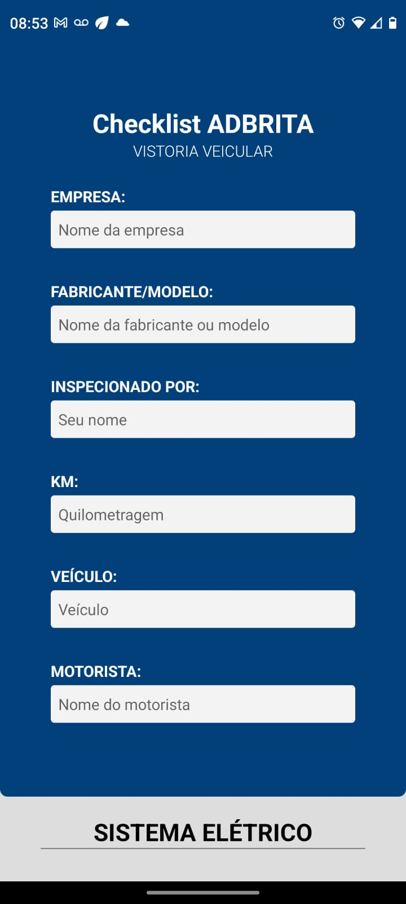
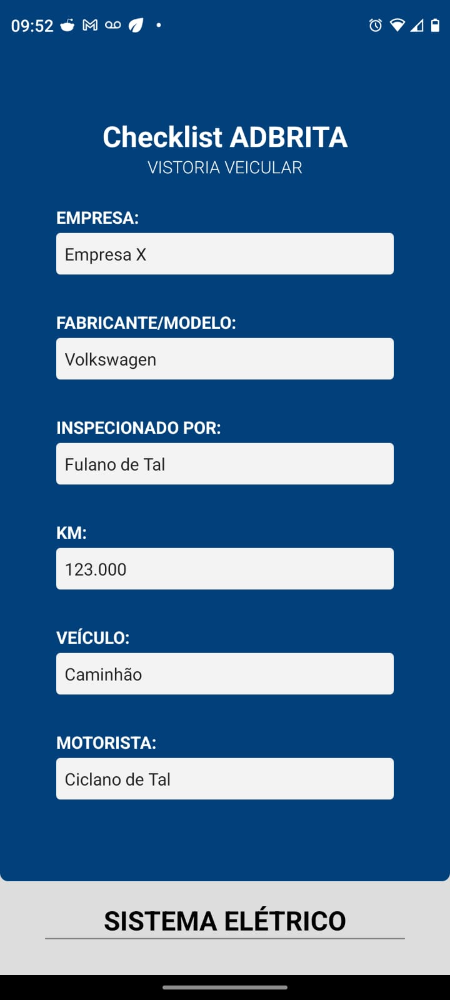
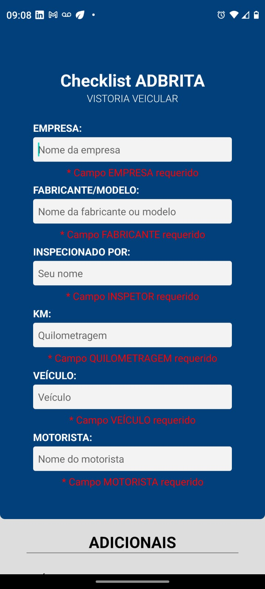
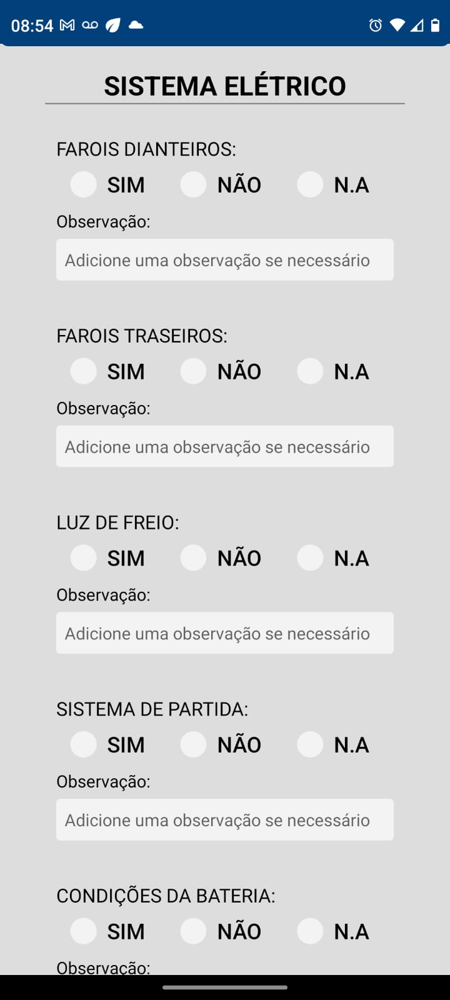
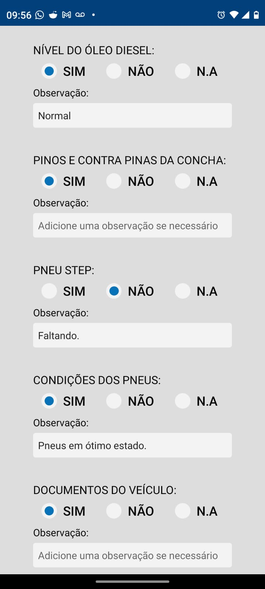
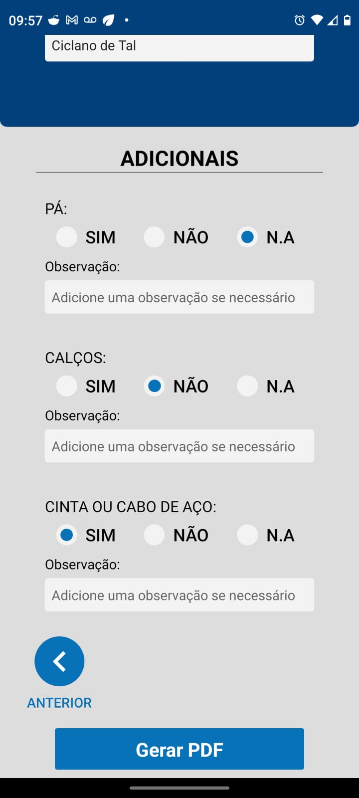
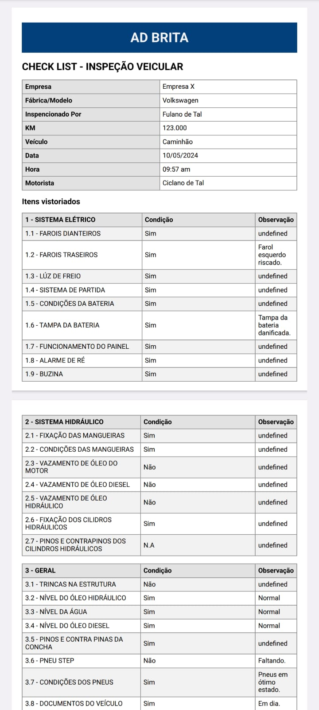
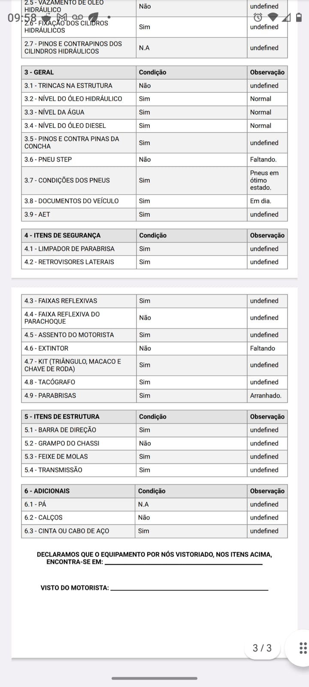

# Check-List App (Vistoria Veicular)

Essa aplicação React Native (EXPO) disponibiliza um formulário em sessões para a vistoria de cada item de um veículo.

O formulário disponibiliza de um sessão geral sobre o veículo e outras sessões específicas.
Em cada item existe um Radio Button para marcar a presença ou ausência daquele item e um campo de observação para fazer anotações sobre aquele mesmo item.

Ao final do preenchimento é possível gerar um documento PDF compatilhável que contém todas as informações preenchidas e outras a mais (como data e hora).

## Imagens das telas:

  
  
  
  
  
  
  
  

